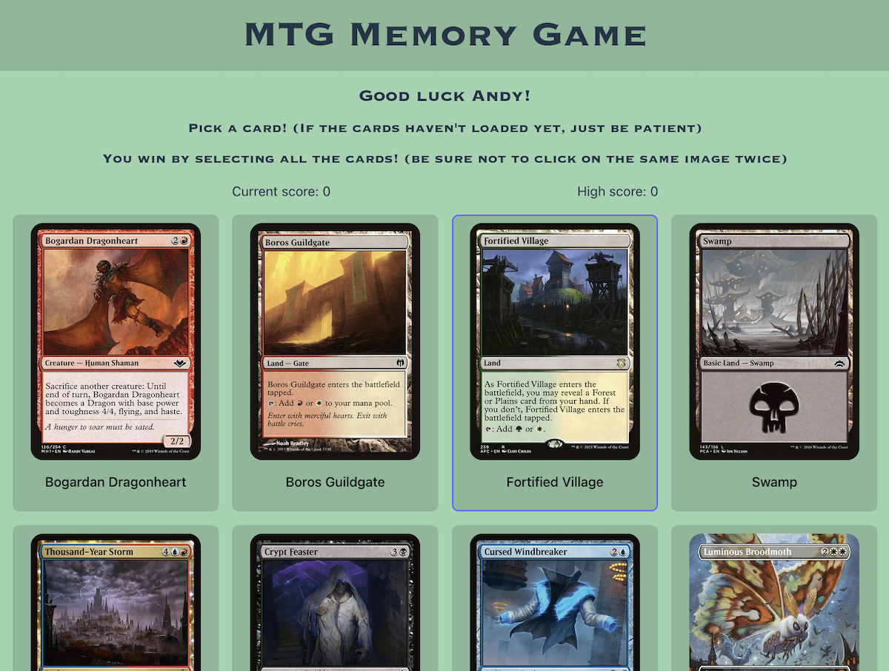

# Memory Card Game

## Table of Contents

- [Description](#description)
- [Installation Instructions](#installation-instructions)
- [Usage and Screenshots](#usage-and-screenshots)
- [Technologies Used](#technologies-used)
- [Dependencies and Credits](#dependencies-and-credits)
- [Project Structure](#project-structure)

## Description

This is a memory card game using the Scryfall API for the backend and Vite and React to build the frontend.

## Installation Instructions

1. Clone or fork this repo
2. cd into the project root directory (where the README.md file is located)
3. Run the following in your terminal
    - ``` bash
      npm init -y
      npm install react react-dom uuid
      npm install @types/react @types/react-dom @vitejs/plugin-react --save-dev
      npm install eslint eslint-config-prettier eslint-plugin-react --save-dev
      npm install eslint-plugin-react-hooks eslint-plugin-react-refresh vite --save-dev
      ```
1. `npm run dev`
   - `^` + `c` will end the process 
1. Navigate to the url displayed in the terminal: `➜  Local:   http://localhost:5173/` 

## Usage and Screenshots



The player first enters their name, then selects an difficulty, then clicks "Let's Go!"

After that the cards will be loaded (sometimes takes a bit) then the player begins clicking the cards. The object of the game is to select each card only once.

- [Link to live preview](https://memory-game-dga.pages.dev/)

### Features

- Uses the Scryfall REST API
- Tracks the cards in state

## Technologies Used

### Frontend

- <a href="https://vite.dev/"> Vite </a>
- <a href="https://react.dev/"> React</a>
- <a href="https://developer.mozilla.org/en-US/docs/Web/JavaScript"> JavaScript</a>
- <a href="https://developer.mozilla.org/en-US/docs/Web/HTML"> HTML</a>
- <a href="https://developer.mozilla.org/en-US/docs/Web/CSS"> CSS</a>

### Development Tools

- <a href="https://code.visualstudio.com/"> VS Code</a>
- <a href="https://www.npmjs.com/"> NPM</a>
- <a href="https://git-scm.com/"> Git</a>

### Hosting

- <a href="https://www.cloudflare.com/"> Cloudflare</a>
- <a href="https://github.com/"> Github</a>


## Dependencies and Credits

### Package Dependencies

- [@types/react](https://www.npmjs.com/package/@types/react)
- [@types/react-dom](https://www.npmjs.com/package/@types/react-dom)
- [@vitejs/plugin-react](https://www.npmjs.com/package/@vitejs/plugin-react)
- [eslint](https://www.npmjs.com/package/eslint)
- [eslint-config-prettier](https://www.npmjs.com/package/eslint-config-prettier)
- [eslint-plugin-react-hooks](https://www.npmjs.com/package/eslint-plugin-react-hooks)
- [eslint-plugin-react-refresh](https://www.npmjs.com/package/eslint-plugin-react-refresh)
- [react-dom](https://www.npmjs.com/package/react-dom)
- [uuid](https://www.npmjs.com/package/uuid)

### Other Credits

- [Devicion](https://devicon.dev/)
- [Skillicons](https://skillicons.dev/)
- [Scryfall API](https://scryfall.com/)


## Project Structure

```bash

├──src/                   # Source files are located here
    └── assets/           # Static images are located here
└──tests/                 # Test files are located here

```
